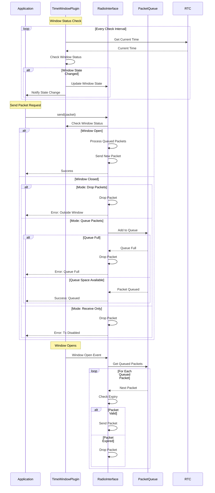

# Time Window Operation Flow



## Operation States

1. **Initial State**
   - Plugin monitors time
   - Radio checks window status
   - Queue empty

2. **Window Open**
   - Normal operation
   - Process queued packets
   - Accept new packets

3. **Window Closed**
   - Drop/Queue/Receive-only
   - Monitor time
   - Maintain queue

4. **State Transition**
   - Process queue
   - Update status
   - Notify observers

## Data Flow

1. **Packet Processing**
   ```
   [Application] -> [Radio Interface]
                -> [Time Window Check]
                -> [Mode Selection]
                -> [Queue/Drop/Block]
   ```

2. **Queue Management**
   ```
   [Queue] -> [Expiry Check]
           -> [Size Management]
           -> [Priority Handling]
   ```

3. **Status Updates**
   ```
   [Time Check] -> [State Update]
                -> [Observer Notification]
                -> [UI Update]
   ```

## Critical Paths

1. **Time Accuracy**
   - RTC synchronization
   - Window transitions
   - Packet timestamps

2. **Queue Management**
   - Memory utilization
   - Packet expiry
   - Queue overflow

3. **State Changes**
   - Quick response
   - Queue processing
   - Status updates
